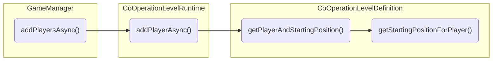

Obsidian plugin to help create diagrams from code.
==================================================

Intended to help debugging stack traces etc into a diagrammatic form.

Initially converts C# stack traces (including async code) into a Mermaid flowchart.

# Example

For an input stack trace that looks like this:

```
cooperation.model.levels.CoOperationLevelDefinition.getStartingPositionForPlayer (System.Int32 playerNum) (at Assets/_CoOPERATION/03Code/model/levels/CoOperationLevelDefinition.cs:226)
cooperation.model.levels.CoOperationLevelDefinition.getPlayerAndStartingPosition (System.Int32 playerNum, System.Int32 characterNum) (at Assets/_CoOPERATION/03Code/model/levels/CoOperationLevelDefinition.cs:236)
cooperation.model.CoOperationLevelRuntime.addPlayerAsync (System.String playerName, System.Int32 playerNumber, System.Int32 characterIndex) (at Assets/_CoOPERATION/03Code/model/levels/CoOperationLevelRuntime.cs:41)
cooperation.model.multiturn.GameManager+<addPlayersAsync>d__26.MoveNext () (at Assets/_CoOPERATION/03Code/model/game/GameManager.cs:316)
```

Output will look like this:

```
\```mermaid
flowchart LR
  subgraph CoOperationLevelDefinition
    COLD.gSPFP("getStartingPositionForPlayer()")
    COLD.gPASP("getPlayerAndStartingPosition()")
  end

  subgraph CoOperationLevelRuntime
    COLR.aPA("addPlayerAsync()")
  end

  subgraph GameManager
    GM.aPA("addPlayersAsync()")
  end

  GM.aPA --> COLR.aPA
  COLR.aPA --> COLD.gPASP
  COLD.gPASP --> COLD.gSPFP
\```
```

Which renders as:



Note the async method (with `<>`) is handled specially, extracting the method name from the angle brackets.

## Usage

To use the function, select lines you wish to convert, and run the command `Convert stack to Mermaid flowchart` (or press the 'die' icon).

# Status

In-development.  Use at your own risk.
